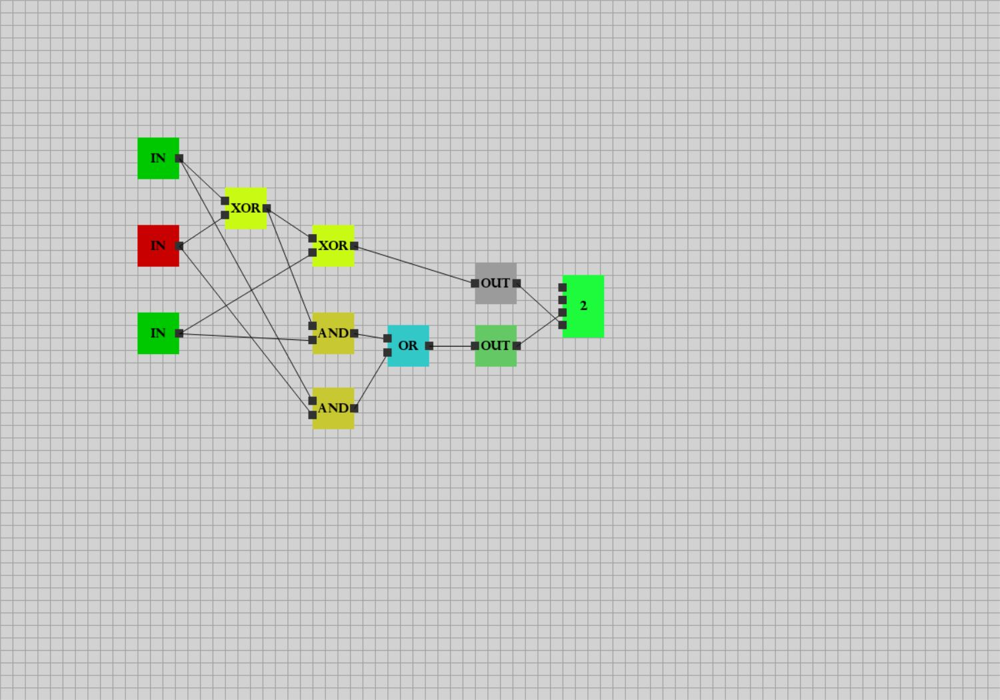

# Computer Simulation WIP

This project consists of simulating electrical gates such as AND, OR,... just for fun.

## Interface

In this program, you can create nodes and gates, and connect them to simulate basic operation.
You can also move every nodes as you want to organize your ideas.

